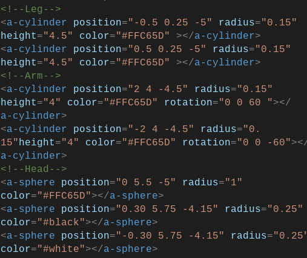

# Tool Learning Log

## Tool: **Aframe**

---

### 3/1/25:
* Watch An <a href="https://www.youtube.com/watch?v=P6sWX25VvxQ&list=PLWkWuhMLkR7D_VSEMkj45NIgF8i2dlUce&index=6">Aframe Video about Modeling.<a>
  * It was really helpful to understand what some of code do.
  * Make a pickcode testing out the model.
* <a href="https://app.pickcode.io/project/cm6zffvpu32izkc1mi0nmn8ru">Simple Model.</a>
  * The Challenge that I faced was that the arm and rotation wasn't working.
  * Next Step
    * Finishing All video on Afrmae.
    * <a href="https://www.youtube.com/playlist?list=PLWkWuhMLkR7D_VSEMkj45NIgF8i2dlUce">Video<a> 
  

### 2/26/25:
* Here Some Code that I make in my Model.
  * 
### 3/13/25
* Created a basic 3D scene with a camera** from A-Frame.
* I found this code searching on A-Frame, and you can find it [here](https://aframe.io/docs/1.7.0/primitives/a-camera.html#main).

```html
<a-scene>
  <!-- Light -->
  <a-light position="2 4 -3" intensity="1"></a-light>
  
  <!-- Camera -->
  <a-camera position="0 1.6 3"></a-camera>
  
  <!-- Box Object -->
  <a-box position="0 1 -5" color="blue" width="2" height="2" depth="2"></a-box>
</a-scene>
```
* Using the camera helps to view the 3D scene from a perspective similar to VR .
* Wondering what else I can create with this code? It's a good starting point for interactive experiences.
* Next steps: I plan to experiment with more code snippets from Aframe.


<!-- 
* Links you used today (websites, videos, etc)
* Things you tried, progress you made, etc
* Challenges, a-ha moments, etc
* Questions you still have
* What you're going to try next
-->
